# Sistema de Gestión de Recursos Tecnológicos

Aplicación SPA desarrollada con **React** y **Next.js** para administrar los
recursos tecnológicos de un laboratorio (notebooks, routers, switches, access
points, impresoras 3D, sensores IoT, kits Arduino, cámaras, herramientas de
red, materiales e insumos), reemplazando el registro manual actual.

## Integrantes

- Bastian Vargas Vasquez

## Objetivo

Gestionar recursos tecnológicos mediante operaciones CRUD (crear, listar,
editar, eliminar) usando **Local Storage** como almacenamiento principal,
**Session Storage** para datos temporales de sesión (filtros/búsqueda) y
**Cookies** para una preferencia simple del usuario (modo claro/oscuro).

## Tecnologías utilizadas

- Next.js 16 (App Router)
- React 19
- TypeScript
- Tailwind CSS
- Local Storage, Session Storage y Cookies (API nativas del navegador)

## Instalación y ejecución

```bash
## Clona el repositorio de github a tu computador
git clone URL_DEL_REPOSITORIO

## Ingresa a la carpeta del proyecto
cd lab-resources

## Instala todas las dependencias del proyecto definidas en package.json
## Este comando descarga las librerias necesarias y crea las carpetas node_modules
npm install

## Inicializa el servidor del desarrollo para ejecutar la app localmente
npm run dev
```

La aplicación queda disponible en `http://localhost:3000`.

Para una build de producción:

```bash
npm run build
npm run start
```


## Estructura de carpetas

```
src/
├── app/
│   ├── page.tsx        # Página principal: conecta hooks, estado y componentes
│   ├── layout.tsx       # Layout raíz de la aplicación
│   └── globals.css      # Estilos globales (Tailwind)
├── components/           # Componentes de interfaz, reutilizables y con una sola responsabilidad
├── hooks/                # Hooks personalizados para cada mecanismo de almacenamiento
├── types/                # Definición de tipos TypeScript (modelo Resource)
└── utils/                # Validaciones de formulario y utilidades (generación de ID, fechas)
```

## Componentes principales

| Componente | Responsabilidad |
|---|---|
| `Header` | Título de la app y acceso al `ThemeToggle`. |
| `ThemeToggle` | Alterna modo claro/oscuro y dispara el guardado en cookie. |
| `ResourceForm` | Registra y edita recursos; ejecuta las validaciones del formulario. |
| `ResourceList` | Renderiza la grilla de `ResourceCard` según el listado filtrado. |
| `ResourceCard` | Muestra un recurso individual, sus acciones (editar/eliminar) y la "Sugerencia IA". |
| `SearchBar` | Input de búsqueda por nombre, sincronizado con Session Storage. |
| `FilterCategory` | Selector de categoría para filtrar el listado, sincronizado con Session Storage. |
| `ConfirmDeleteModal` | Modal de confirmación antes de eliminar un recurso. |

## Hooks utilizados

- **`useState`**: estado local de formularios, modales y edición en curso.
- **`useEffect`**: sincroniza el estado de los hooks personalizados con el
  almacenamiento del navegador cada vez que cambian.
- **`useMemo`**: calcula categorías disponibles y el listado filtrado sin
  recalcular en cada render.
- **`useLocalStorage(key, initialValue)`** *(personalizado)*: persiste y
  recupera cualquier valor serializable en Local Storage. Usado para la lista
  de recursos (`lab_resources`).
- **`useSessionStorage(key, initialValue)`** *(personalizado)*: igual que el
  anterior, pero usando Session Storage. Usado para los filtros temporales de
  sesión (`lab_resource_filter`).
- **`useCookie(name, initialValue)`** *(personalizado)*: lee y escribe una
  cookie simple (`lab_theme`) para la preferencia visual del usuario.

Todos los hooks personalizados están marcados con `"use client"` porque
acceden a APIs del navegador (`window`, `document`), que no existen durante
el renderizado en el servidor.

## Persistencia de datos

| Mecanismo | Clave | Contenido |
|---|---|---|
| Local Storage | `lab_resources` | Arreglo completo de recursos tecnológicos (la fuente de verdad del CRUD). |
| Session Storage | `lab_resource_filter` | Texto de búsqueda actual y categoría seleccionada para filtrar. Se pierde al cerrar la pestaña. |
| Cookie | `lab_theme` | Preferencia de tema (`light` / `dark`). No contiene datos sensibles. |

No se almacena en ningún mecanismo del navegador contraseñas, tokens ni
información personal sensible, conforme a las condiciones de la evaluación.

## Validaciones

El formulario (`ResourceForm` + `utils/validations.ts`) valida:

- **Nombre**: obligatorio, mínimo 3 caracteres.
- **Categoría**: obligatoria.
- **Cantidad**: obligatoria, numérica, entera y mayor a 0.
- **Estado**: obligatorio (Disponible / En uso / En mantención).
- **Ubicación**: obligatoria.
- **Responsable** y **Descripción**: opcionales.

Los errores se muestran debajo de cada campo y el formulario no se envía
mientras existan errores de validación.

## Uso de inteligencia artificial

Se utilizó **Claude (Anthropic)** como apoyo durante el desarrollo para:

- Generar la estructura inicial de componentes, hooks y tipos.
- Redactar las validaciones del formulario.
- Implementar la función simulada "Sugerencia IA" dentro de `ResourceCard`
  (reglas locales según la categoría del recurso; no consume ninguna API
  externa de IA).
- Verificar que el proyecto compilara y funcionara correctamente antes de la
  entrega.

El equipo debe revisar, comprender y poder explicar cada parte del código
entregado.

## Capturas de pantalla

_Agregar aquí capturas del CRUD funcionando (listado, formulario, modo
oscuro, eliminación, etc.)._

### listado: Como se puede observar en la evidencia se encuentra el listado de los 4 equipos 

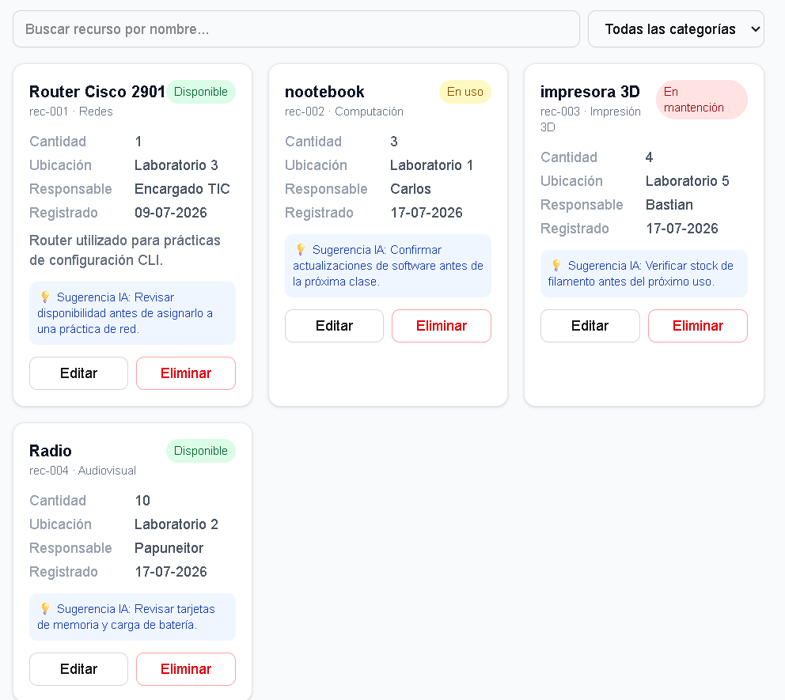

### Busqueda: Se hace una busqueda por medio del nombre del equipo

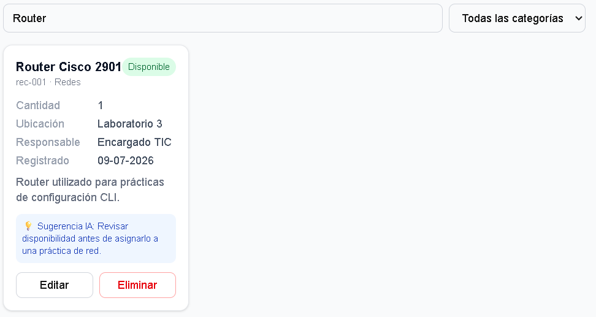

### Busqueda Categoria: Se busco por medio del select categoria y me busco el equipo

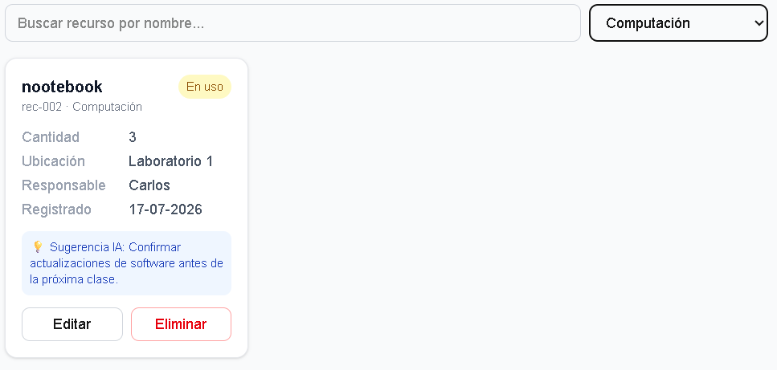

### Formulario: Como se observa en el formulario, se deben poner los datos para poder ingresar algun equipo, Pero se arrojaron las validaciones de ingreso el link en el repositorio de las validaciones es [validaciones](src/utils/validations.ts)

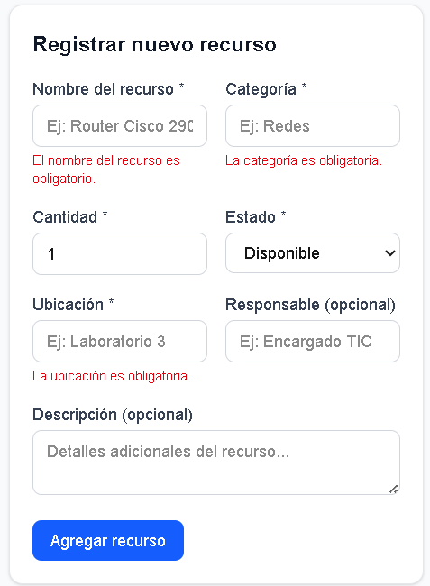

### Eliminacion: Al eliminar el equipo, nos desplazara a un modal de confirmacion, si se aprieta eliminar, se eliminara el registro

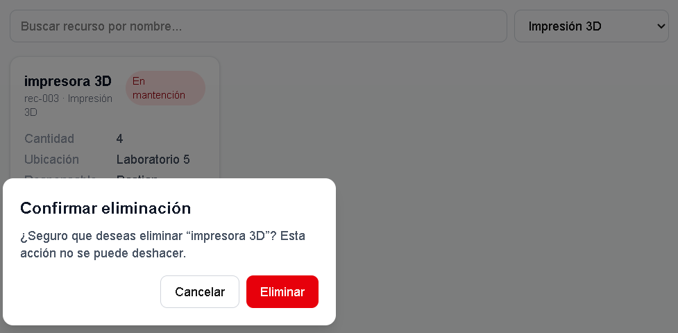

### Actualizar: Como se observa en el formulario, se pudo editar el nombre del representante y luego se actualizo 

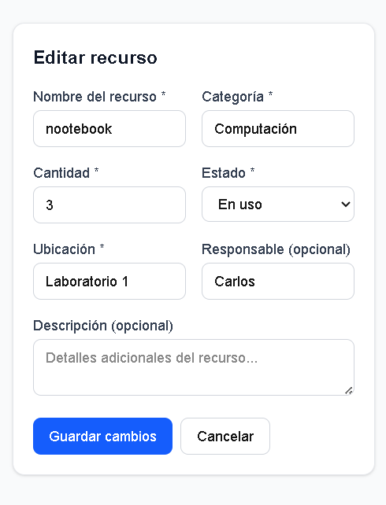
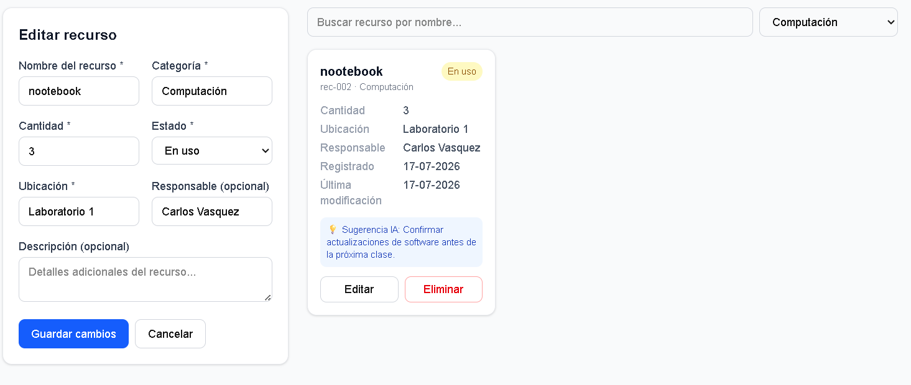

### Modo Oscuro: El fondo posee modo normal y al apretar el modo oscuro, el fondo se oscurece

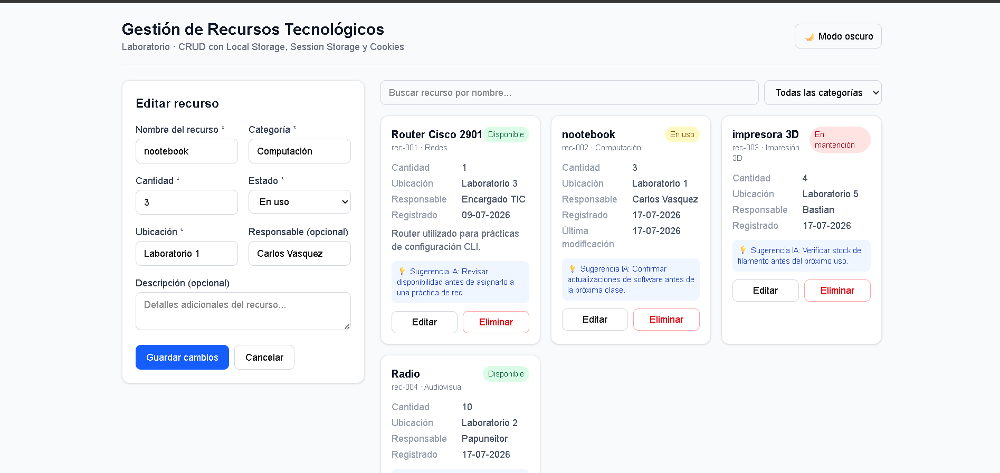
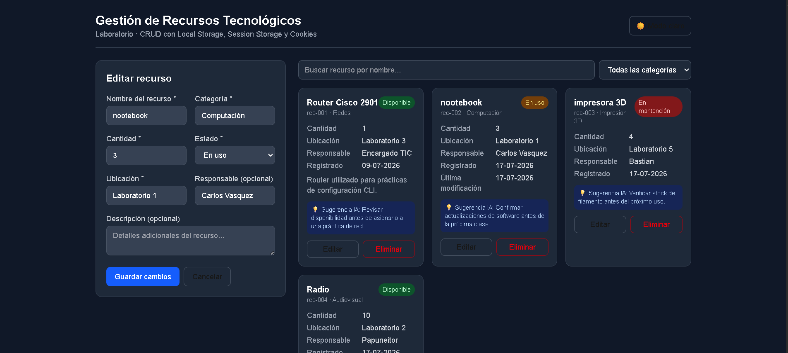

### Error: EL error fue producido porque el estado inicial del hook useLocalStorage no estaba sincronizado con los datos almacenados en el localStorage, lo que provocaba inconsistencias al cargar la app y al renderizar los componentes que dependian de esa informacion

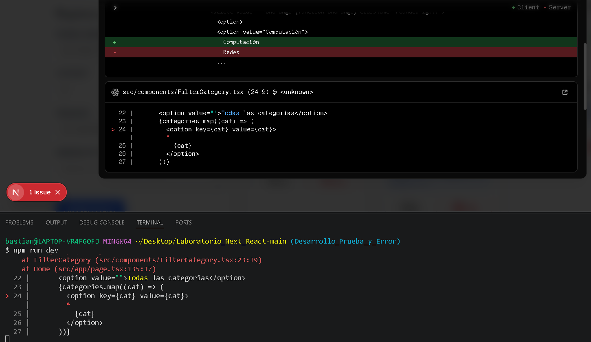

### Solucion: Se implemento un useEffect que se ejecuta al montar el componente y recuperar el valor almacenado mediante window.localStorage.getItem(key). Si existe un dato guardado, este se convierte desde formato JSON utilizando JSON.parse() y se actualiza el estado con setValue(). De esta forma, el estado se inicializa correctamente con la informacion persistida y evitando el error durante la ejecucion
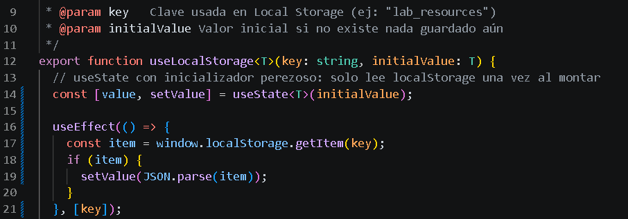

### Criterio de evaluacion:
📋 Criterio de Evaluación
| Criterio | Ubicación del archivo en el repositorio |
|----------|-------------------------------------------|
| ✅ CRUD funcional | src/app/page.tsx (lógica CRUD), src/components/ResourceForm.tsx (crear/editar), src/components/ResourceList.tsx y src/components/ResourceCard.tsx (listar), src/components/ConfirmDeleteModal.tsx (eliminar) |
| 💾 Local Storage | src/hooks/useLocalStorage.ts, usado en src/app/page.tsx con la clave lab_resources |
| 🍪 Session Storage y Cookies | src/hooks/useSessionStorage.ts (filtros de búsqueda) y src/hooks/useCookie.ts (tema claro/oscuro), usados en src/app/page.tsx |
| 🧩 Componentes y Hooks | Componentes en src/components/ (Header, ThemeToggle, ResourceForm, ResourceList, ResourceCard, SearchBar, FilterCategory, ConfirmDeleteModal); Hooks en src/hooks/ (useLocalStorage.ts, useSessionStorage.ts, useCookie.ts) |
| ✔️ Validaciones y manejo de errores | src/utils/validations.ts, aplicado en src/components/ResourceForm.tsx |
| 🎨 Interfaz y experiencia de usuario | src/app/globals.css, componentes en src/components/ (diseño con Tailwind CSS) |
| 📖 Documentación técnica | README.md (raíz del repositorio) |
| 🐙 Repositorio GitHub | .gitignore (raíz del repositorio), historial de commits del repositorio |

## Pagina en github page: Se trabajo adicionalmente con github action y con procesos de automatizacion y se creo esta pagina 

{Ver Sitio en Vivo}https://bastian319.github.io/Eva4-Front_end/

## Conclusión

Este proyecto permitió comprender las diferencias prácticas entre Local Storage, Session Storage y Cookies: cada uno cumple un propósito distinto (persistencia general, datos temporales de sesión y preferencias simples, respectivamente). También se aprendió a evitar errores de hidratación en Next.js, sincronizando el estado con el navegador recién dentro de un useEffect, y a organizar la lógica de almacenamiento en hooks personalizados reutilizables. El despliegue en GitHub Pages ayudó a entender la diferencia entre un proyecto con servidor y uno exportado como sitio estático.